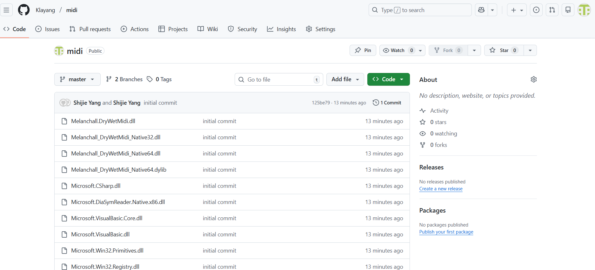
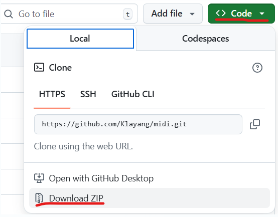
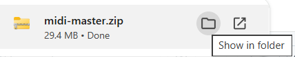
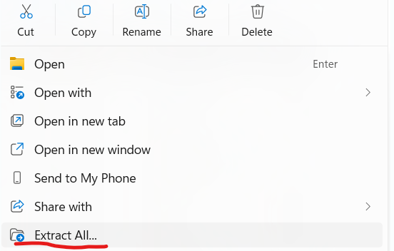
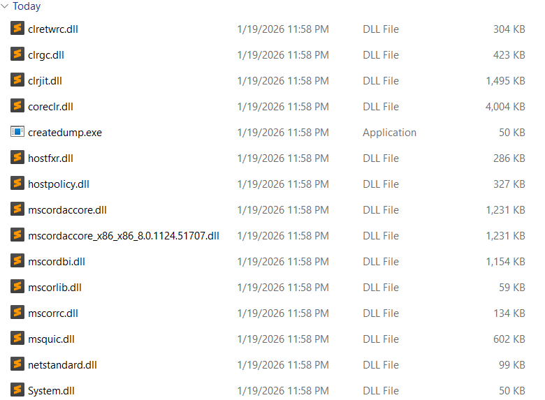
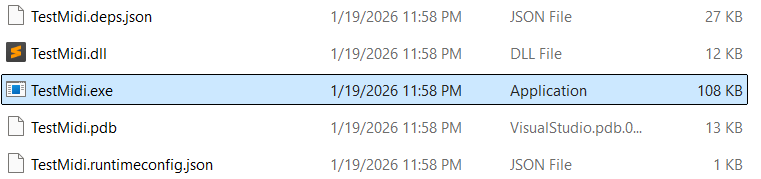
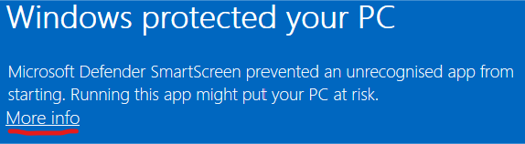

1. Go to https://github.com/Klayang/midi/tree/beach

2. You can see the following interface. Click the green `Code` then `Download ZIP`
   
   
   
   

3. When the download completes, go to the folder where it's at
   
   

4. Unzip the file and enter the directory, where you see a lot of files
   
   
   
   

5. Find `TestMidi.exe` and click it. Windows warns you not to do that. Don't worry. I don't bite :)
   
   
   
   
   
   

    
